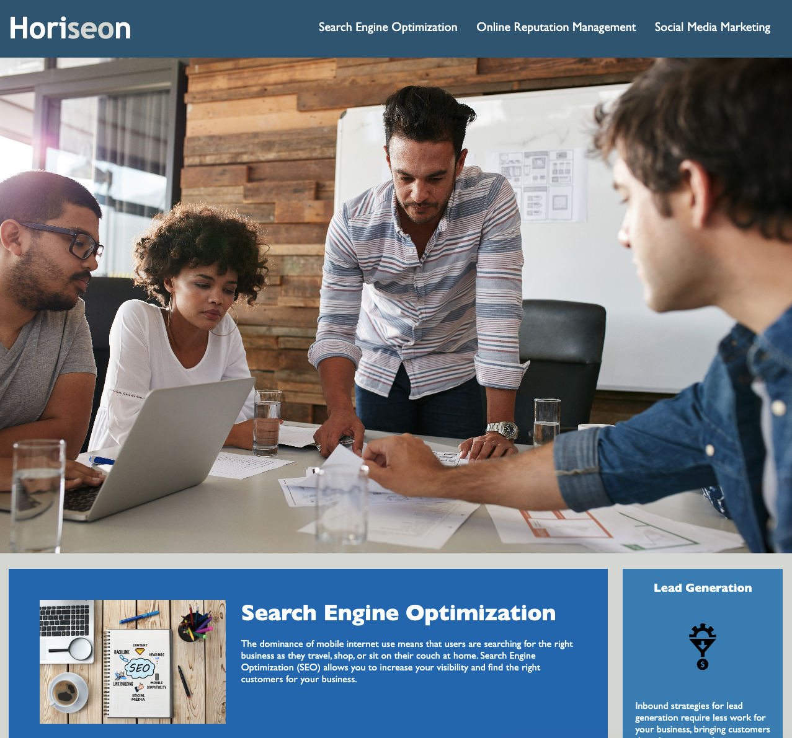

# code-refactor-HTML-CSS-M1

This is a refactor for a website for Horiseon Social Solution Services displaying the services offered and the benefits of those services.

HTML code has been refactored to utilize semantic tags.

CSS stylesheet has been consolidated and reorganized to follow the new semantic structure of the HTML.

Alt tags have been added for accessibility and search engine optimization.

